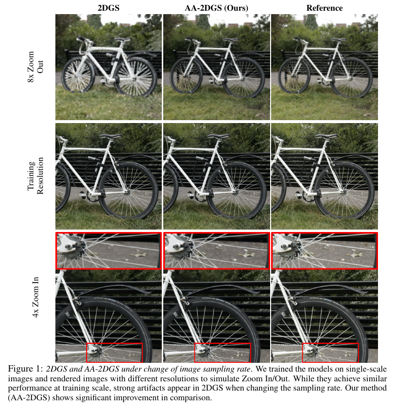
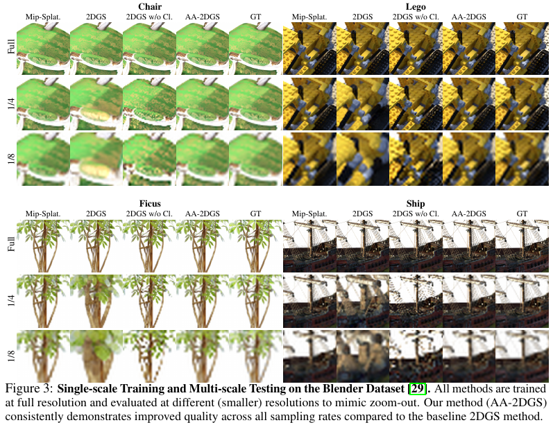
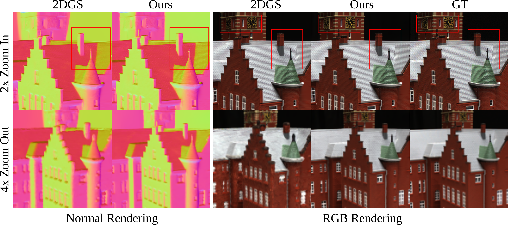

<p align="center">

  <h1 align="center">AA-2DGS: Anti-Aliased 2D Gaussian Splatting</h1>
  <p align="center">
    <a href="https://maeyounes.github.io">Mae Younes</a>
    -
    <a href="https://boukhayma.github.io">Adnane Boukhayma</a>

  </p>
  <h2 align="center">NeurIPS 2025</h2>

  <h3 align="center"><a href="https://openreview.net/pdf?id=4TP1SuInE5">Paper</a> | <a href="https://arxiv.org/abs/2506.11252">arXiv</a> </h3>
  <div align="center"></div>
</p>


<p align="center">
  <a href="">
    
  </a>
</p>

<p align="center">
  <a href="">
    
  </a>
</p>
<p align="center">
  <a href="">
    
  </a>
</p>

<p align="center">
This repository contains the official implementation of AA-2DGS, an antialiased 2D Gaussian Splatting method that eliminates aliasing artifacts due to camera zoom, distances and varying fields of view by introducing a world-space flat smoothing kernel and object-space Mip filtering, preserving geometric accuracy while enabling high-quality rendering at arbitrary sampling rates.
</p>
<br>


## Installation

```bash
# Clone the repository
git clone https://github.com/maeyounes/AA-2DGS.git
cd AA-2DGS
# if you already have setup up an environment for 3dgs/2dgs, you can use it
# if not, create a new environment
conda create -y -n aa_2dgs python=3.8 
conda activate aa_2dgs

# Install PyTorch with CUDA 11.7, note the cuda version should match your local cuda version
pip install torch==2.0.0+cu117 torchvision==0.15.0 -f https://download.pytorch.org/whl/cu117/torch_stable.html

pip install -r requirements.txt

pip install submodules/diff-surfel-rasterization
pip install submodules/simple-knn/

```

# Datasets
## Blender Dataset
You can download and unzip nerf_synthetic.zip from the [NeRF's official Google Drive](https://drive.google.com/drive/folders/1cK3UDIJqKAAm7zyrxRYVFJ0BRMgrwhh4). Then generate multi-scale blender dataset with
```
python convert_blender_data.py --blender_dir datasets/nerf_synthetic/ --out_dir datasets/multi-scale
```

## Mip-NeRF 360 Dataset
You can download the data from the [Mip-NeRF 360](https://jonbarron.info/mipnerf360/) and request the authors for the treehill and flowers scenes.

## DTU Dataset
For geometry reconstruction on DTU dataset, please download the preprocessed data from [Drive](https://drive.google.com/drive/folders/1SJFgt8qhQomHX55Q4xSvYE2C6-8tFll9). You also need to download the ground truth [DTU point cloud](https://roboimagedata.compute.dtu.dk/?page_id=36). 

# Training and Evaluation
```
# single-scale training and multi-scale testing on NeRF-synthetic dataset
python scripts/run_nerf_synthetic_stmt.py 

# multi-scale training and multi-scale testing on NeRF-synthetic dataset
python scripts/run_nerf_synthetic_mtmt.py 

# single-scale training and single-scale testing on the mip-nerf 360 dataset
python scripts/run_mipnerf360.py 

# single-scale training and multi-scale testing on the mip-nerf 360 dataset
python scripts/run_mipnerf360_stmt.py 

# geometry reconstruction on DTU dataset
python scripts/run_dtu_mipfiltering.py
```


# Acknowledgements
This project is built upon [2DGS](https://github.com/hbb1/2d-gaussian-splatting) and [3DGS](https://github.com/graphdeco-inria/gaussian-splatting). We also use code snippets from [Mip-Splatting](https://github.com/autonomousvision/mip-splatting).

Please follow the license of 3DGS. We thank all the authors for their great work and repos. 

# Citation
If you find our paper or code useful, please cite
```bibtex
@inproceedings{younes2025anti,
  title={Anti-Aliased 2D Gaussian Splatting},
  author={Younes, Mae and Boukhayma, Adnane},
  booktitle={The Thirty-ninth Annual Conference on Neural Information Processing Systems},
  year={2025}
}
```
